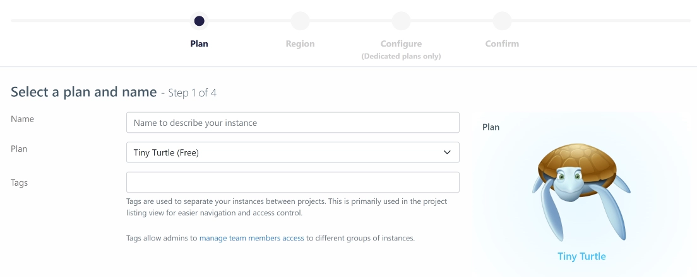
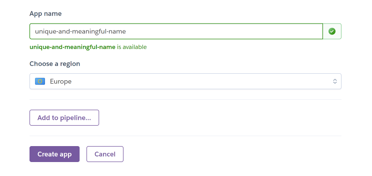
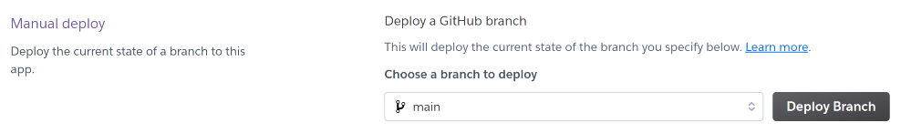

# **_Where next? - Django REST Framework API_**

This repository is the back-end REST API which is used by my front-end project, [Where next]()

You can view the live site here - 

You can view the live API here - 

You can view the front-end README.md here - 

You can view the back-end README.md here - 

## Contents

- [**Objective**](#objective)
- [**User Experience (UX)**](#user-experience-ux)
  - [User Stories](#user-stories)
- [**Agile Methodology**](#agile-methodology)
- [**Entity Relationship Diagram**](#entity-relationship-diagram)
- [**Database**](#database)
- [**Models**](#models)
- [**Testing**](#testing)
  - [Manual Testing](#manual-testing)
  - [PEP8 Validation](#pep8-validation)
  - [Bugs Fixed](#bugs-fixed)
  - [Bugs Unresolved](#bugs-unresolved)
- [**Technologies Used**](#technologies-used)
  - [Languages](#languages)
  - [Libraries and Frameworks](#libraries-and-frameworks)
  - [Other Tools](#other-tools)
- [**Development**](#development)
  - [GitHub](#github)
  - [Django](#django)
- [**Deployment**](#deployment)
  - [ElephantSQL](#create-the-elephantsql-database)
  - [Heroku](#heroku)
- [**Credits**](#credits)
  - [Content](#content)
  - [Media](#media)
- [**Acknowledgments**](#acknowledgements)

# 

## Objective


*Please note: To open any external links in a new browser tab, please press **CTRL + Click***

#

## User Experience (UX)

### User Stories

7 Epics were created as Milestones which were further developed into 16 User Stories. The user stories were then broken down into tasks to faciliatate the User Story's execution. Most of the issues were closed automatically when commiting to GitHub, as shown in the commit history.

[#1](https://github.com/chris-townsend/drf-api-where-next/issues/1) - *As a **Developer**, I should **install and develop the profiles app** so that **users can create their own profiles.***

[#2](https://github.com/chris-townsend/drf-api-where-next/issues/2) - *As a **Developer**, I should **create a serializer for my profiles app** so that **my data can be converted to native Python datatypes that can then be easily rendered into `JSON`.***

[#3](https://github.com/chris-townsend/drf-api-where-next/issues/3) - *As a **Developer**, I should **install and develop the posts app** so that **users can create their own posts.***

[#4](https://github.com/chris-townsend/drf-api-where-next/issues/4) - *As a **Developer**, I should **create a serializer for my posts app** so that **my data can be converted to native Python datatypes that can then be easily rendered into `JSON`.***

[#5](https://github.com/chris-townsend/drf-api-where-next/issues/5) - *As a **Developer**, I should **develop the post detail view** so that **I can retrieve, update and delete a post.***

[#6](https://github.com/chris-townsend/drf-api-where-next/issues/6) - *As a **Developer**, I should **install and develop the comments app** so that **users can create comments on posts.***

[#7](https://github.com/chris-townsend/drf-api-where-next/issues/7) - *As a **Developer**, I should **create a serializer for my comments app** so that **my data can be converted to native Python datatypes that can then be easily rendered into `JSON`.***

[#8](https://github.com/chris-townsend/drf-api-where-next/issues/8) - *As a **Developer**, I should **create a serializer for my comments detail app** so that **my data can be converted to native Python datatypes that can then be easily rendered into `JSON`.***

[#9](https://github.com/chris-townsend/drf-api-where-next/issues/9) - *As a **Developer**, I should **install and develop the likes app** so that **users can like a post.***

[#10](https://github.com/chris-townsend/drf-api-where-next/issues/10) - *As a **Developer**, I should **create a serializer for my likes app** so that **my data can be converted to native Python datatypes that can then be easily rendered into `JSON`.***

[#11](https://github.com/chris-townsend/drf-api-where-next/issues/11) - *As a **Developer**, I should **install and develop the follower's app** so that **users can follow each other.***

[#12](https://github.com/chris-townsend/drf-api-where-next/issues/12) - *As a **Developer**, I should **create a serializer for my follower's app** so that **my data can be converted to native Python datatypes that can then be easily rendered into `JSON`.***

[#13](https://github.com/chris-townsend/drf-api-where-next/issues/13) - *As a **Developer**, I should **install and develop the bookmarks app** so that **users can bookmark posts***

[#14](https://github.com/chris-townsend/drf-api-where-next/issues/14) - *As a **Developer**, I should **create a serializer for my bookmark's app** so that **my data can be converted to native Python datatypes that can then be easily rendered into `JSON`.***

[#15](https://github.com/chris-townsend/drf-api-where-next/issues/15) - *As a **Developer**, I should **install and develop the contact app** so that **users can contact the site owner.***

[#16](https://github.com/chris-townsend/drf-api-where-next/issues/16) - *As a **Developer**, I should **create a serializer for my contact app** so that **my data can be converted to native Python datatypes that can then be easily rendered into `JSON`.***

***

## Agile Methodology

GitHub projects were used to manage the development process using an agile approach. To view the project kanban board, please click on the link [here](https://github.com/users/chris-townsend/projects/6/views/1)


# Entity Relationship Diagram


[Back to top](#contents)

# Database


For this project, I implemented two databases.

The first one was the [SQLite](https://www.sqlite.org/index.html). This was used for the development side of the project and allows you to have a small, fast, self-contained SQL database engine.

The second database, which is a PostgreSQL database hosted by [ElephantSQL](https://www.elephantsql.com/) was used for the production database.


### Production Database


### Development Database


[Back to top](#contents)

# Models

### Comment

The comment model allows the user to create a comment on a post. If a comment is deleted, it is deleted from both the User and post models

| Database Value | Field Type    | Field Argument                     |
| -------------- | ------------- | ---------------------------------- |
| owner          | ForeignKey    | User, on_delete=models.CASCADE     |
| created_date   | DateTimeField | auto_now_add=True                  |
| updated_date   | DateTimeField | auto_now=True                      |
| comment        | TextField     |                                    |

### Profile


[Back to top](#contents)

# Testing

## Python

### PEP8 Validation

Code Institutes [PEP8](https://pep8ci.herokuapp.com/) linter was used to test the Python files. The table below shows the pages tested and their result, all pages are error-free in the final deployment.


| *Page / App*           |**where_next_drf_api**|  **bookmarks** |**comments** |**contact**|
| ---                    |      :---:           |    :---:       |   :---:     |  :---:    |
| `admin.py`             |     *n/a*            |    *n/a*       |   *n/a*     |  *n/a*    | 
| `apps.py`              |     *n/a*            |    *pass*      |   *pass*    |  *pass*   |
| `permissions.py`       |     *pass*           |    *n/a*       |   *n/a*     |  *n/a*    | 
| `serializers.py`       |     *pass*           |    *pass*      |   *pass*    |  *pass*   |
| `models.py`            |     *n/a*            |    *pass*      |   *pass*    |  *pass*   |
| `urls.py`              |     *pass*           |    *pass*      |   *pass*    |  *pass*   |
| `views.py`             |     *n/a*            |    *pass*      |   *pass*    |  *pass*   |
| `wsgi.py`              |     *pass*           |    *n/a*       |   *n/a*     |  *n/a*    |


| *Page / App*           |  **followers**  |   **likes**   |  **posts**  |  **profiles**  |
| ---                    |      :---:      |    :---:      |   :---:     |    :---:       | 
| `admin.py`             |    *n/a*        |    *n/a*      |   *n/a*     |    *n/a*       |
| `apps.py`              |    *pass*       |   *pass*      |  *pass*     |    *pass*      |
| `permissions.py`       |    *n/a*        |    *n/a*      |   *n/a*     |    *n/a*       | 
| `serializers.py`       |    *pass*       |   *pass*      |  *pass*     |    *pass*      | 
| `models.py`            |    *pass*       |   *pass*      |  *pass*     |    *pass*      |
| `urls.py`              |    *pass*       |   *pass*      |  *pass*     |    *pass*      |
| `views.py`             |    *pass*       |   *pass*      |  *pass*     |    *pass*      |
| `wsgi.py`              |    *n/a*        |    *n/a*      |   *n/a*     |    *n/a*       | 


***

## Manual Testing


### profiles


### comments


## Bugs Fixed


## Bugs Unresolved


# Technologies Used

## Languages

- [Python](https://www.python.org/) - A programming language that lets you work quickly
  and integrate systems more effectively

## Libraries and Frameworks

- [Django](https://pypi.org/project/Django/) - Django is a high-level Python web framework that encourages rapid development and clean, pragmatic design.

- [Django REST Framework](https://pypi.org/project/djangorestframework/) - A powerful and flexible toolkit for building Web APIs

- [cloudinary](https://pypi.org/project/cloudinary/) - Easily integrate your application with Cloudinary
- [dj-database-url](https://pypi.org/project/dj-database-url/) - Allows you to utilize the 12factor inspired DATABASE_URL environment variable to configure your Django application.
- [dj-rest-auth](https://pypi.org/project/dj-rest-auth/) - API endpoints for handling authentication securely in Django Rest Framework
- [django-allauth](https://pypi.org/project/django-allauth/) - Integrated set of Django applications addressing authentication, registration, account management as well as 3rd party (social) account authentication
- [django-cloudinary-storage](https://pypi.org/project/django-cloudinary-storage/) - package that facilitates integration with Cloudinary by implementing Django Storage API
- [django-cors-headers](https://pypi.org/project/django-cors-headers/) - Adds Cross-Origin Resource Sharing (CORS) headers to responses.
- [django-extensions](https://pypi.org/project/django-extensions/) - Collection of global custom management extensions for the Django Framework.
- [django-filter](https://pypi.org/project/django-filter/) - Declaratively add dynamic QuerySet filtering from URL parameters.
- [django-rest-auth](https://pypi.org/project/django-rest-auth/) - Provides a set of REST API endpoints for Authentication and Registration
- [djangorestframework-simplejwt](https://pypi.org/project/djangorestframework-simplejwt/) - JSON Web Token authentication plugin for the Django REST Framework.
- [gunicorn](https://pypi.org/project/gunicorn/) - A Python WSGI HTTP Server for UNIX.
- [idna](https://pypi.org/project/idna/) - Support for the Internationalized Domain Names in Applications (IDNA) protocol
- [mypy-extensions](https://pypi.org/project/mypy-extensions/) - Defines extensions to the standard “typing” module that are supported by the mypy type checker and the mypyc compiler.
- [oauthlib](https://pypi.org/project/oauthlib/) - Implements the logic of OAuth1 or OAuth2 without assuming a specific HTTP request object or web framework.
- [pathspec](https://pypi.org/project/pathspec/) - Utility library for pattern matching of file paths
- [Pillow](https://pypi.org/project/Pillow/) - Adds image processing capabilities to your Python interpreter
- [psycopg2](https://pypi.org/project/psycopg2/) - PostgreSQL database adapter for Python
- [pycodestyle](https://pypi.org/project/pycodestyle/) - A tool to check your Python code against some of the style conventions in PEP 8.
- [pydot](https://pypi.org/project/pydot/) - Library to generate .dot files which can be used to show ERD's
- [PyJWT](https://pypi.org/project/PyJWT/) - Library for encoding and decoding JSON Web Tokens (JWT)
- [pyparsing](https://pypi.org/project/pyparsing/) - Python parsing module
- [pytz](https://pypi.org/project/pytz/) - Allows accurate and cross platform timezone calculations
- [requests](https://pypi.org/project/requests/) - Allows you to send HTTP/1.1 requests
- [requests-oauthlib](https://pypi.org/project/requests-oauthlib/) - OAuthlib authentication support for Requests

- [sqlparse](https://pypi.org/project/sqlparse/) - A non-validating SQL parser for Python. It provides support for parsing, splitting and formatting SQL statements.
- [urllib3](https://pypi.org/project/urllib3/) - A powerful, user-friendly HTTP client for Python

## Other Tools

- [GitHub](https://github.com/) - Used to host and deploy the website as well as manage the project.
- [Heroku](https://dashboard.heroku.com) - Used to deploy the website
- [SQLite](https://www.sqlite.org/index.html) - An open-source, zero-configuration, self-contained, stand-alone, transaction relational database engine designed to be embedded into an application.
- [ElephantSQL](https://www.elephantsql.com/) - Provides a browser tool for SQL queries where you can create, read, update and delete data directly from your web browser.
- [Cloudinary](https://cloudinary.com/) - Used to host all static files .

- [CI PEP8 Linter](https://pep8ci.herokuapp.com/#)

[Back to top](#contents)

*** 

# Development

This site was made using [GitHub](#github) & [Gitpod](https://www.gitpod.io/). The site was further developed using Django and Django REST framework.

## GitHub

### Create the repository

1. Sign in to GitHub and navigate to [Code Institute's Gitpod template](https://github.com/Code-Institute-Org/gitpod-full-template).

 - At the top of the repository, click **Use this template** followed by **Create a new repository**.

 

*Alternatively:*

1. Click the GitHub label in the top left of the nav section.


2. Select **New** next to **Top Repositories**.     


3. Select the **template** you wish to use.                


4. Give the repository a name and description and then click **Create repository**.


The repository has now been created and is ready for editing through the Gitpod terminal.
 
***

[Back to top ⇧](#contents)

## Django

### Installing Django and supporting libraries

To initialise a Django project, first Django must be installed within your Python environment. This is done via the command `pip3 install 'django<4' gunicorn`

**Django 3.2 is the LTS (Long Term Support) version of Django and is therefore preferable to use over the newest Django 4.**

**1.** Create a Django project (*drf-api-where-next*): `django-admin startproject 'PROJ_NAME' .`

**(Don’t forget the ``.`` at the end of the project name to tell Django admin we want to create our project in the current directory.)**

 - This should have created a new directory called your `'PROJ_NAME'` and a `manage.py` file. Within your project folder, you should see the file settings and URL files added to the directory.

**2.** Install Cloudinary libraries: `pip3 install dj3-cloudinary-storage`

- Cloudinary will be used to store our static media files.

**3.** Create Apps within project (*bookmarks, comments, contact, followers, likes, posts, profiles*) - `python3 manage.py startapp 'APP_NAME'`

- When the App has been installed, you need to add it to your `INSTALLED_APPS` within `settings.py`

 ```
 INSTALLED_APPS = [
    …
    'bookmarks',
    'comments',
    'contact',
    'followers',
    'likes',
    'posts',
    'profiles'
]
```

- Save changes and then **Migrate changes** in the terminal - `python3 manage.py migrate`

- Whenever a new app is created, migrations are automatically created and these changes need migrating. By migrating the changes, it adds all of the changes to the database.

**4.** In order to use JSON web tokens we will be using the Django rest auth library, install by typing in the command: 

- `pip3 install dj-rest-auth`

- In `settings.py`, add **rest_framework.authtoken** and **dj_rest_auth** to `INSTALLED_APPS`

```
INSTALLED_APPS = [
    "rest_framework.authtoken",
    "dj_rest_auth",
]
```

**5.** Add the *rest auths urls* to the main **urlpatterns** list.

```
urlpatterns = [
    path("dj-rest-auth/", include("dj_rest_auth.urls")),
]
```
- Migrate the database by typing `python manage.py migrate`

**6.** Next install Django allauth with the following command - `pip install 'dj-rest-auth[with_social]'` and add the new application to the `INSTALLED_APPS` variable in **settings.py**.

```
INSTALLED_APPS = [
    "django.contrib.sites",
    "allauth",
    "allauth.account",
    "allauth.socialaccount",
    "dj_rest_auth.registration",
]
```

**7.** Add a `SITE_ID` variable in **settings.py**

`SITE_ID = 1`

**8.** Add the *registration urls* to the main **urlpatterns** list.

```
urlpatterns = [
    path('dj-rest-auth/registration/', include('dj_rest_auth.registration.urls')),
]
```

**9.** The Django rest framework doesn’t support JWT tokens for the browser interface out-of-the-box, we’ll need to use session authentication in development and for Production we’ll use Tokens. This will allow us to continue to be able to log into our API as we work on it. To start, install the JWT library - `pip install djangorestframework-simplejwt`

**10.** In `settings.py`, set the **DEBUG** value to True only if the `DEV` environment variable exists. This will mean it is True in development, and False in production.

```DEBUG = 'DEV' in os.environ```

- Add the following code to the `REST_FRAMEWORK` variable to differenciate between development and production. `DATETIME_FORMAT` has been added to present `created_date` and `updated_date` more human-readable. Pagination is used to help manage the request load by chunking the results and makes fetching much easier for the user.


```
REST_PAGINATION = "rest_framework.pagination.PageNumberPagination"

REST_FRAMEWORK = {
    "DEFAULT_AUTHENTICATION_CLASSES": [
        (
            "rest_framework.authentication.SessionAuthentication"
            if "DEV" in os.environ
            else "dj_rest_auth.jwt_auth.JWTCookieAuthentication"
        )
    ],
    "DEFAULT_PAGINATION_CLASS": REST_PAGINATION,
    "PAGE_SIZE": 10,
    "DATETIME_FORMAT": "%d %b %Y",
}
```

**11.** To enable token authentication, cookie declaration and to also ensure that the tokens are sent over HTTPS only, add the following code to `settings.py`.

```
REST_USE_JWT = True
JWT_AUTH_SECURE = True
JWT_AUTH_COOKIE = "my-app-auth"
JWT_AUTH_REFRESH_COOKIE = "my-refresh-token"
JWT_AUTH_SAMESITE = "None"
```

**12.** Add the `profile_id` and `profile_image` to fields returned when requesting logged in user details. Firstly create a `serializers.py` file in the main project folder.

- Import the appropriate files - 

```
from dj_rest_auth.serializers import UserDetailsSerializer
from rest_framework import serializers
```

- Create the **profile_id** and **profile_image** fields.

```
class CurrentUserSerializer(UserDetailsSerializer):
    profile_id = serializers.ReadOnlyField(source='profile.id')
    profile_image = serializers.ReadOnlyField(source='profile.image.url')
    class Meta(UserDetailsSerializer.Meta):
        fields = UserDetailsSerializer.Meta.fields + ('profile_id', 'profile_image')
```

- Overwrite the default `USER_DETAILS_SERIALIZER` in **settings.py**:

```
REST_AUTH_SERIALIZERS = {'USER_DETAILS_SERIALIZER': 'drf_api.serializers.CurrentUserSerializer'}
```

**13.** Set the default renderer to JSON for the production environment. This means that we want this nice, in-browser interface to be available in development only. All the frontend app cares about is JSON so sending HTML would be pointless. In `settings.py`, below the `REST_FRAMEWORK` variable, add: 

```
if 'DEV' not in os.environ:
    REST_FRAMEWORK['DEFAULT_RENDERER_CLASSES'] = [
        'rest_framework.renderers.JSONRenderer',
    ]
```

- If the **DEV** environment variable is **NOT** present, set the rest framework’s default renderer classes attribute to JSONRenderer inside a list.

**14.** Create a new root route which will act as a welcome screen to anyone who visits the homepage of our API.

- First create a new `views.py` file in the main project folder (where_next_drf_api) and add the following code:

```
from rest_framework.decorators import api_view
from rest_framework.response import Response
from .settings import (JWT_AUTH_COOKIE, JWT_AUTH_REFRESH_COOKIE,
                       JWT_AUTH_SAMESITE, JWT_AUTH_SECURE,)

@api_view()
def root_route(request):
    return Response(
        {"message": "Welcome to my django rest framework API for Where next\
        - social media platform"})
```

- Add the new route to the **urlpatterns** list in the main `urls.py` file and remember to import root_route from .views - `from .views import root_route`

```
urlpatterns = [
    path('', root_route),
]
```

**15.** Remove the value for `SECRET_KEY` in **settings.py** and replace with the following code to use an environment variable instead.

- `SECRET_KEY = os.getenv('SECRET_KEY')`

**16.** Create a new env.py file at the top-level directory - `env.py`

#### - Within `env.py`:

| Instruction | Code |
| --- | --- |
| **1.** Import os library | `import os` |
| **2.** Add in secret key | `os.environ.setdefault("SECRET_KEY", "NEW_SECRET_KEY_HERE")`  |

- Set a new value for your `SECRET_KEY` environment variable.

**17.** In the terminal of your Gitpod workspace, install **gunicorn**.

- `pip3 install gunicorn django-cors-headers`

**18.** Update your `requirements.txt`

`pip freeze --local > requirements.txt`

**19.** Create a file named **Procfile** at the top-level directory - `Procfile`

- Add the following code: 

```
release: python manage.py makemigrations && python manage.py migrate
web: gunicorn drf_api.wsgi
```

***

# Deployment

### Create the ElephantSQL database:

As the database provided by Django is only accessible within Gitpod and is not suitable for a production environment. The deployed project on Heroku will not be able to access it. So, you need to create a new database that can be accessed by Heroku. The following steps will create a new PostgreSQL database instance for use within the project.

**1.** Log in to [ElephantSQL](https://customer.elephantsql.com/instance#) to access your dashboard.


**2.** Click **Create New Instance** at the top right of the page.        


**3.** Set up your **plan**.
- Give your plan a **Name** (this is commonly the name of the project)
- Select the **Tiny Turtle (Free)** plan
- You can leave the **Tags** field blank



**4.** Click **Select Region**.        


**5.** Select a **data centre** near you.


**6.** Click **Review**.                 


**7.** Ensure your details are correct and then click **Create instance**.


**8.** Return to the **ElephantSQL dashboard** and you should see your **database instance name** for this project.


[Back to top ⇧](#contents)

# 

## Heroku

To deploy this page to Heroku from its GitHub repository, the following steps were taken:

### Create the Heroku App:

**1.** Log in to [Heroku](https://dashboard.heroku.com/apps) or create an account.


**2.** On your Heroku dashboard, click the button labelled **New** in the top right corner and from the drop-down menu select **Create new app**.


**3.** Enter a **unique and meaningful app name** and **choose the region** which is best suited to your location.

- Click on the **Create app** button.

**4.** Select **Settings** from the tabs at the top of the app page.


**5.** Click **Reveal Config Vars**.    


**6.** Add a Config Var `DATABASE_URL` and for the value, copy in your database URL from your ElephantSQL database instance.


**7.** To connect to our external database, **dj_database_url** and **psycopg2** are required, install in the terminal: 

```
pip3 install dj_database_url==0.5.0 psycopg2
```

**8.** In your **settings.py** file, import **dj_database_url** underneath the import for os

```
import os
import dj_database_url
```

**9.** Update the `DATABASES` section so that when you have an environment variable for `DEV` in your environment the code will connect to the sqlite database here in Gitpod. Otherwise, it will connect to your external database, provided the `DATABASE_URL` environment variable exist.

```
 if 'DEV' in os.environ:
     DATABASES = {
         'default': {
             'ENGINE': 'django.db.backends.sqlite3',
             'NAME': BASE_DIR / 'db.sqlite3',
         }
     }
 else:
     DATABASES = {
         'default': dj_database_url.parse(os.environ.get("DATABASE_URL"))
     }
```

**10.** In your `env.py` file, add a new environment variable to Gitpod with the key set to `DATABASE_URL`, and the value to your *ElephantSQL* database URL.

`os.environ.setdefault("DATABASE_URL", "<your PostgreSQL URL here>")`

- *Add quotes as this needs to be a string.*

**11.** Migrate your database models to your new database.

- `python3 manage.py migrate`

**12.** In *settings.py*, update the value of the `ALLOWED_HOSTS` variable to include your Heroku app’s URL:

`ALLOWED_HOSTS = ['localhost', '<your_app_name>.herokuapp.com']`

**13.** Add corsheaders to `INSTALLED_APPS`.

```
INSTALLED_APPS = [
    'dj_rest_auth.registration',
    'corsheaders',
 ]
 ```

 **14.** Add *corsheaders middleware* to the **TOP** of the **MIDDLEWARE.**

 ```
 SITE_ID = 1
 MIDDLEWARE = [
     'corsheaders.middleware.CorsMiddleware',
     ...
 ]
 ```

 **15.** Import the regular expression module `re` at the top of your settings.py file.

 `import re`
 
 -  Under the **MIDDLEWARE** list, set the `ALLOWED_ORIGINS` for the network requests made to the server.

```
 if 'CLIENT_ORIGIN' in os.environ:
    CORS_ALLOWED_ORIGINS = [
        os.environ.get('CLIENT_ORIGIN')
    ]

if 'CLIENT_ORIGIN_DEV' in os.environ:
    extracted_url = re.match(
        r'^.+-', os.environ.get('CLIENT_ORIGIN_DEV', ''), re.IGNORECASE
    ).group(0)
    CORS_ALLOWED_ORIGIN_REGEXES = [
        rf"{extracted_url}(eu|us)\d+\w\.gitpod\.io$",
    ]
```

- The code above is used in order to make the application more secure and when the `CLIENT_ORIGIN_DEV` environment variable is defined, the unique part of the gitpod preview URL is extracted. It is then included in the regular expression so that the gitpod workspace is still connected to our API when gitpod rotates the workspace URL. This allows our API to talk to our development environment. The value for `CLIENT_ORIGIN_DEV` will be set and explained in the [Development](#) section of my front end application.

**16.** Enable sending cookies in cross-origin requests so that users can get authentication functionality - 

```CORS_ALLOW_CREDENTIALS = True```

**17.** To be able to have the front end app and the API deployed to different platforms, set the `JWT_AUTH_SAMESITE` to **'None'**.

`JWT_AUTH_SAMESITE = 'None'`

**18.** Ensure the `requirements.txt` file is up to date. 

`pip freeze --local > requirements.txt`

**19.** Back on your **Heroku dashboard**, open the Settings tab.


**20** Input all key-value pairs from the `env.py` file.


| KEY | VALUE |
| --- | --- |
|``DATABASE_URL``|=  ``****``  |
|``SECRET_KEY``  |=  ``****``  |
|``CLOUDINARY_URL`` |=  ``****``  |
|``DISABLE_COLLECTSTATIC``  |= `1` |

**21.** Select **Deploy** from the tabs at the top of the app page.


**22.** Select **Connect to GitHub** from the deployment methods.


**23.** Search for the repository to connect to by name.


 - Your app should now be connected to your GitHub account.


 **24.** Select **Enable Automatic Deploys** for automatic deployments.


- If you would like to deploy manually, select **Deploy Branch**. If you manually deploy, you will need to re-deploy each time the repository is updated.



- For the first time deploying to Heroku, you may have to deploy manually but if you select automatic deploys it will update from then onwards.

**25** Click **View** to view the deployed site.


- Check that your program has deployed, you should see the JSON welcome message from the home screen.


# Credits

### Content

- [Django REST framework](https://www.django-rest-framework.org/)

- [Code Institute - *'drf_api'* walkthrough project](https://github.com/Code-Institute-Solutions/drf-api)


# Acknowledgments


[Back to top ⇧](#contents)